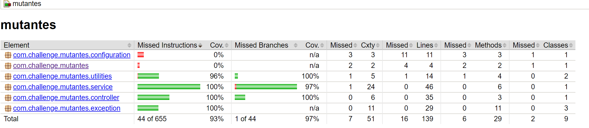

# Mutantes

Challenge MercadoLibre

# Links importantes:

- [URL para probar servicio (via Swagger UI)](https://mutantes-challenge.herokuapp.com/swagger-ui.html)
- [Dashboard de Grafana](https://yaminnicolas.grafana.net/d/CygwzfpGk/mutants-app-dashboard?orgId=1)
  (Usuario: yaminnicolas/Password: mutants1)
- [UI de Prometheus](https://mutants-prometheus.herokuapp.com/graph)
- [Metricas expuestas por la App](https://mutantes-challenge.herokuapp.com/actuator/prometheus)
 
# Contenido

- [Ejercicio](#ejercicio)
  - [Algoritmo](#Algoritmo)
  - [Analisis asintotico](#Analisis-asintotico)
- [Tecnologias usadas](#Tecnologias-usadas)
- [Instrucciones de uso](#Instrucciones-de-uso)
  - [Setup local](#setup-local)
  - [API hosteada](#API-cloud)
  - [API Url](#api)
  - [Servicios](#servicios)
    - [Test ADN individual](#isMutant)
    - [Test ADN masivo](#testRandomDna)
- [Metricas](#Metricas)
  - [Prometheus](#Prometheus)
  - [Grafana](#Grafana)
- [Unit testing](#Unit-testing)
- [Comentarios y consideraciones finales](#Comentarios-y-consideraciones-finales)

## Ejercicio

### Algoritmo

Para la resolucion del proyecto se recurrió a una aproximacion semi-naive. A grandes rasgos, los pasos que se siguen son los 
siguientes:
- Primero se verifica si el ADN ingresado no se encuentra en el banco de datos de Magneto, en cuyo caso se devuelve True/False 
de acuerdo a los registros para ese humano.
- En caso de no hallarse en BD, se verifica la validez de la entrada, con consideracion entre las cuales podemos mencionar: La cantidad de cadenas de
ADN deben corresponder con la longitud de las mismas (para formar una matriz cuadrada), solo se admiten como caracteres las bases
nitrogenadas (A, C, T o G) y no puede haber cadenas mas cortas/largas que las demas.
- La entrada se convierte en una matriz de caracteres y se pasa al metodo que analiza mutaciones.
- Para verificar lso patrones, se recorre la matriz caracter por caracter, por filas.
- Al aislar una base nitrogenada, se verifican coincidencias en 4 direcciones (Horizontal, Vertical, Diagonal Izquierda y Diagonal
Derecha). 
- Si se encuentra una coincidencia, se sigue en la misma direccion, verificando sucesivas coincidencias, hasta que se encuentre una
base distinta o bien se excedan los limites de la matriz. Cada vez que se encuentra una coincidencia, se almacena su posicion en
una lista de patrones. 
- Luego, esta lista se compara en longitud con la longitud minima de un patron mutante (al menos 4 coincidencias). Si es igual o mayor
a 4, tenemos una primer coincidencia y se almacena en una variable correspondiente.
- Se sigue recorriendo en busca de un segundo patron. Si se encuentra, se debe verificar que no sea un subpatron de la coincidencia
anterior, por lo cual se lo compara con esta. De ser distintos, tenemos una segunda coincidencia y el algoritmo finaliza su ejecucion
e informa que se encontró un mutante.
- De llegar al final con una o cero coincidencias, el ADN es humano, y se informa adecuadamente.
- El ADN se persiste, junto con el resultado del analisis, en Base de datos.

### Analisis asintotico

En el peor de los casos (el ADN es humano), la matriz debe recorrerse en su totalidad, caracter por caracter, por lo cual la eficiencia
es de O(N^2). Si bien para cada caracter se deben analizar cuatro direcciones, las comparaciones en este caso son constantes (al igual
 que la carga de la matriz) y pueden ignorarse en el resultado final. 
 
 Cabe destacar que, mientras mayor sea la matriz de ADN, mayores son las probabilidades de que se encuetre mas de un patron de 
 mutacion y la ejecucion del algoritmo termine antes. Asimismo, siempre se verifica previamente la existencia del ADN ingresad en BD
, con lo cual muchas veces el algoritmo simplemente no se ejecuta.
 
 En cuanto a eficiencia de almacenamiento, se debe transformar la entrada en una matriz cuadrada de caracteres. Asimismo, se usan un 
 par de listas de Points para guardar coincidencias y patrones. En general no se recurre a un uso excesivo de espacio de almacenamiento.

## Tecnologias usadas

- Lenguaje: [Java 1.8](https://www.java.com/es/)
- Framework y librerias: [Spring Framework, Spring Boot, Spring JPA, etc](https://spring.io/)
- Gestor de proyecto y dependencias: [Maven](https://maven.apache.org/)
- Base de Datos: [PostgreSQL](https://www.postgresql.org/)
- Documentacion/testing de API: [Swagger](https://swagger.io/)
- Unit Testing: [jUnit](http://junit.org/junit5/)
- Hosting: [Heroku](https://www.heroku.com/)
- Metricas: [Prometheus](https://prometheus.io/)
- Dashboard de metricas: [Grafana](https://grafana.com/)
- [Docker](https://www.docker.com/)


## Instrucciones de uso

### Setup local
Se debe contar con Java 1.8 y Maven para gestionar las dependencias y realizar el build del proyecto. 

- Clonar el [repositorio](https://github.com/nicoyamin/mutantes.git)
- La aplicacion debe conectarse a la BD de Postgre hosteada remotamente pasando las siguientes variables de entorno:
    - **SPRING_DATASOURCE_URL**=jdbc:postgresql://ec2-52-72-34-184.compute-1.amazonaws.com:5432/d2hb7j151km671
    - **SPRING_DATASOURCE_USERNAME**=ianihvahpoovul
    - **SPRING_DATASOURCE_PASSWORD**=0ab7c36e3a9dbd57537884823ca8967bf4c19db843828a2b57d03aeaf96a219a
    - **SPRING_JPA_DATABASE-PLATFORM**=org.hibernate.dialect.PostgreSQLDialect
    - **SPRING_JPA_HIBERNATE_DDL-AUTO**=validate   
- Iniciar localmente la aplicacion. El incio tarda unos 60 segundos debido a la conexion remote con la BD
- Una vez en ejecucion, se pueden realizar llamados a la API mediante un cliente REST o bien ingresando a la [UI de Swagger](http://localhost:8080/swagger-ui.html#),
la cual incluye la definicion de contrato de cada endpoint y la posibildad de probarlos. En cualquiera de los dos casos, consultar
la seccion de [servicios](#servicios) para los detalles de cada endpoint y como invocarlos.
- Tambien pueden consultarse las metricas expuestas por la aplicacion ingresando a esta [URL](http://localhost:8080/actuator/prometheus) 
- Como toda aplicacion Spring Boot, esta inicia por defecto en el puerto 8080

### API cloud

La aplicacion se encuentra hosteada en Heroku, haciendo uso de los recursos ofrecidos por el free tier. Se puede acceder a la misma
desde el siguiente link:

- URL de API en Heroku: (https://mutants-prometheus.herokuapp.com/) (Solo para llamadas mediante cliente REST)
- URL de Swagger UI: (https://mutantes-challenge.herokuapp.com/swagger-ui.html)
- URL de metricas: (https://mutantes-challenge.herokuapp.com/actuator/prometheus) 

```
  **IMPORTANTE**: las aplicaciones hosteadas en el free tier de Heroku se suspenden luego de 30 minutos de inactividad, 
  por lo cual es posible que se tarde unos 20 segundos en ingresar a las URL correspondientes la primera vez.
```


### Servicios

Se recomienda consultar los contratos de manera mas detallada en [SwaggerUI](https://mutantes-challenge.herokuapp.com/swagger-ui.html)

#### isMutant

Descripcion: 
- Verifica si un ADN es mutante o humano.

Request: 
- POST https://mutants-prometheus.herokuapp.com/human/isMutant

Request body (ADN mutante):

```
  {"dna":["ATGCGA", "CAGGGC", "TTATGT", "AGAAGG", "CCCCTA", "TCACTG"]}
```

Response:

```
  200 Mutant detected
```
Request body (ADN humano):

```
  {"dna":["AATACT", "CCCAGA", "GGGATT", "AATTCC", "GGATCG", "TCACTG"]}
```

Response:

```
  403 Not a mutant
```

#### testRandomDna

Descripcion: 
- Analiza la cantidad deseada de secuencias de ADN del tamaño provisto. Para ello, se generan de manera aleatoria las secuencias del
tamaño ingresado. Es util para cargar datos en DB, probar tiempos de respuesta y obtener datos para el dashboard de metrricas.

Request: 
- GET https://mutants-prometheus.herokuapp.com/human/testRandomDna

Paremeters:
- dnaAmount(int) - Numero de secuencias a analizar
- dnaSize(int) - Tamaño de las secuencias

Request URL ejemplo:
```
https://mutantes-challenge.herokuapp.com/human/testRandomDna?dnaAmount=10&dnaSize=6
```

Response: 200 (application/json)

```
10 DNAs were tested, out of which 1 are mutant and 9 are human.
```

## Metricas

### Prometheus
En lugar de exponer un servicio de estadisticas, se opto por usar [Prometheus](https://prometheus.io/), una herramienta open source 
que funciona como un scrapper de cualquier metrica que se decida exponer desde la aplicacion, y ademas incluye una serie de librerias 
para incorporar metricas personalizadas en nuestro codigo. Gracias a estas ultimas, se puede llevar cuenta de la cantidad de mutantes
y humanos detectados por la aplicacion. Estas metricas estan expuestas con los siguientes labels:

- count_mutant_dna
- count_human_dna

Se pueden observar sus valores en el endpoint del actuator de Prometheus (https://mutantes-challenge.herokuapp.com/actuator/prometheus)
o bien desde la UI de Prometheus (https://mutants-prometheus.herokuapp.com/graph) donde ademas se permite ver graficos basicos de todas
las metricas, asi como agregar los datos. Por ejemplo, para ver el ratio de mutantes sobre humanos, en el editor de expresiones, escribir:

```
count_mutant_dna/(count_human_dna+count_mutant_dna)
```

**IMPORTANTE!** Al estar hosteado en el free tier de Heroku, el servicio de Prometheus se apaga luego de 30 minutos de inactividad, 
por lo cual las metricas obtenidas hasta ese momento se pierden (cosa que no pasaria en un servidor de produccion). Para obtener medidas
de prueba, se recomienda utilizar el endpoint para analizar multiples ADN aleatorios, de manera tal que se carguen datos para Prometheus.

### Grafana
Grafana permite establecer el servicio de Prometheus como Datasource para recopilar todas las metricas expuestas y representarlas
graficamente en un dashboard, con multitud de paneles y herramientas de monitoreo distintas, ademas de manipular los datos con un
Query Language para personalizar la informacion que queremos analizar.

Para poder observar mejor todo lo que ofrece Prometheus, se ha configurado un dashboard donde pueden observarse distintas metricas 
utilizacion, requests y recursos del server, ademas de las cuentas de ADN de mutantes/humanos y su ratio:

- [Dashboard de Grafana](https://yaminnicolas.grafana.net/d/CygwzfpGk/mutants-app-dashboard?orgId=1)
  - Usuario: yaminnicolas
  - Password: mutants1

**IMPORTANTE!** Al depender del servicio de Prometheus como Datasoruce, si este se apaga por inactividad, es posible que las metricas se desactualicen, 
por lo cual se recomienda cargar entradas de ADN nuevas para actualzair la informacion del dashboard.

## Unit testing

Se utilizó Junit 5 para realizar testeos automaticos, y Mockito para el mockeo de dependencias. Se procuró cubrir la mayor cantidad de casos posibles, y pasar por todos los branches en el codigo. Solo quedan pendientes de testing la clase Main y de configuracion de Swagger. El coverage report fue generado por [JaCoCo](https://www.eclemma.org/jacoco/) y puede encontrarse en la carpeta jacoco de este repositorio.

[Reporte de coverage](jacoco/index.html)



## Comentarios y consideraciones finales

El proyecto puede ser mejorado en muchos aspectos, los cuales pueden hablarse durante la entrevista de review. Entre ellos, pueden mencionarse:

- Rendimiento de la API: Quedaron pendientes pruebas de carga usando JMeter. Tenia pensado incluso integrar estas metricas en un panel de Grafana para que puedan observarse desde alli, sin embargo por cuestiones de tiempo esto no pudo concretarse. Sin embargo, el rendimiento de los requests es aceptable desde el host en cloud, debido a que al parecer esta optimizado para abrir hilos de acuerdo al trafico y balancea la carga de manera automatica, ademas de que la BD Postgre esta optimizada para funcionar con Heroku. Sin embargo, no ocurre lo mismo al ejecutar la aplicacion localmente, donde se observa un renidmiento menor.
- Queda pendiente la implementacion de un pipeline para CI/CD
- Implementacion de una BD local (se consideró usar H2) para testing.

Ante cualquier duda, consulta o inconveniente, no duden en contactarme por email a nicoyamin@hotmail.com.ar

